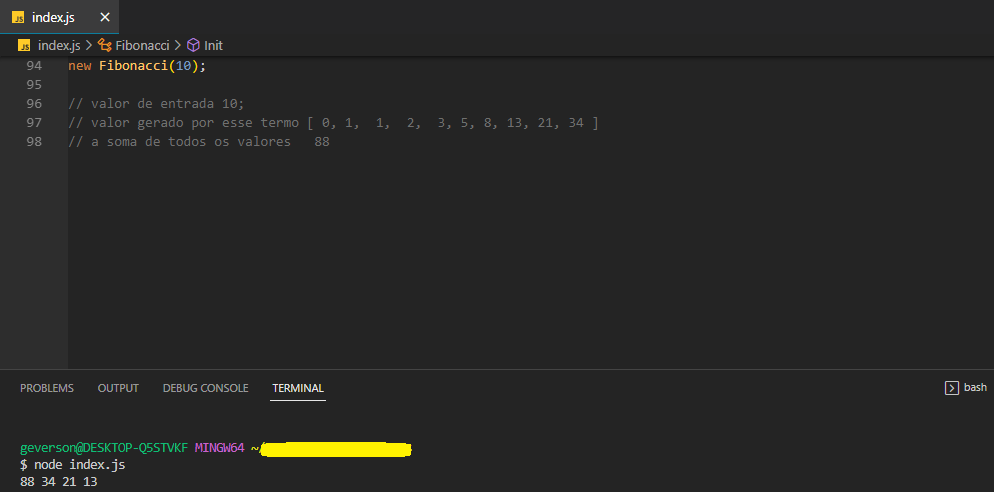

# my_fibonacci

<b> Na matemática, a sucessão de Fibonacci, é uma sequência de números inteiros, começando normalmente por 0 e 1, na qual cada termo subsequente corresponde à soma dos dois anteriores </b>

este código cria a sequencia de fibonacci inicializando em 0,
a sequencia so pode ser criada a partir do termo 3 ou seja [ 0, 1, 1 ],
soma todos os valores gerado a partir do termo e exibir os 4 últimos valores de traz pra frente...
junto a soma de todos os valores da sequencia.

<b>EXEMPLO</b>
<i>Entrada 3 :-gera-sequencia-> 2 1 1 0 </i>
 
 
 
 

VEJA A SAIDA!

